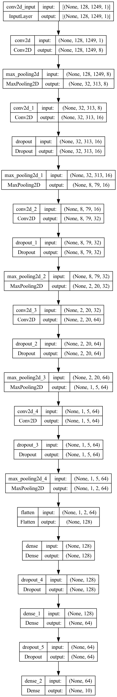
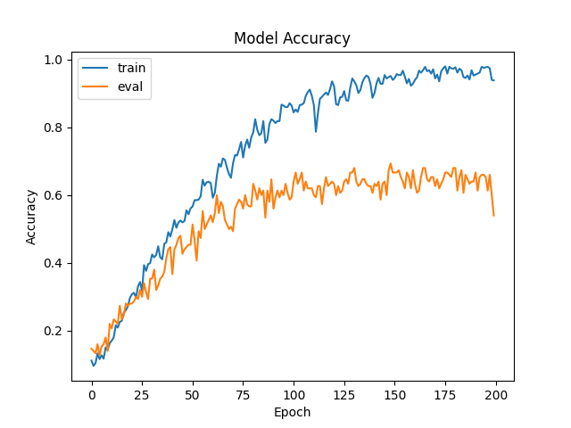
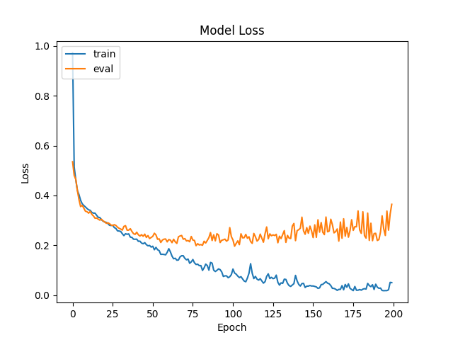

# GZTAN Music Classification

This project uses the [GTZAN Genre Collection dataset](https://arxiv.org/abs/1306.1461) from

> Tzanetakis, George, and Perry Cook. "Musical genre classification of audio signals." IEEE Transactions on speech and audio processing 10.5 (2002): 293-302.

I built a simple CNN to predict the musical genre of the test set which was 15% of the total dataset.  The validation set comprised of an additional 15% and the training set was the remaining 70%.  The architecture of the model was very, very loosely inspired by [Alexnet](https://proceedings.neurips.cc/paper_files/paper/2012/file/c399862d3b9d6b76c8436e924a68c45b-Paper.pdf) but with smaller filter numbers, added DropOut layers, smaller filter sizes, and a few other choices to make the layer sizes a little easier to plan out.  The smaller filter numbers were chosen to speed up training time, DropOut was added to combat overfitting to the training set and the smaller filter sizes were chosen since larger ones seemed to not work as well.  Additionally, Batch Normalization layers were also added as an exploration, but were ultimately omitted since they did not yield better performance.  The architecture can be see below:




Setup
-----
Prerequisites: brew ([brew.sh](brew.sh) for installation instructions)

```
brew install pyenv pyenv-virtualenv graphviz direnv
```

Direnv is used to create, activate, and deactivate the virtual environment for this project.  Upon first use and edit, you must allow direnv to make changes to your system.

```
direnv allow
```

Once the virtual environment is activated, install the python requirements via:

```
pip install -r requirements.txt
```

Data was downloaded from Kaggle ([link](https://www.kaggle.com/datasets/andradaolteanu/gtzan-dataset-music-genre-classification)) due to tensorflow datasets timing out at time of development.  Ensure that the location of the dataset corresponds to the arguments passed into classify/prepare_dataset.py

Running the code
-----
The data is prepared using `classify/prepare_dataset.py`, you can use the default arguments or override them as needed.  The network is build, trained, and tested using `classify/train_and_predict.py`.

Results
-----
This model achieves a 63.33% accuracy on the test set with the best model (based on validation accuracy) after 200 epochs of training with minibatches of 32



